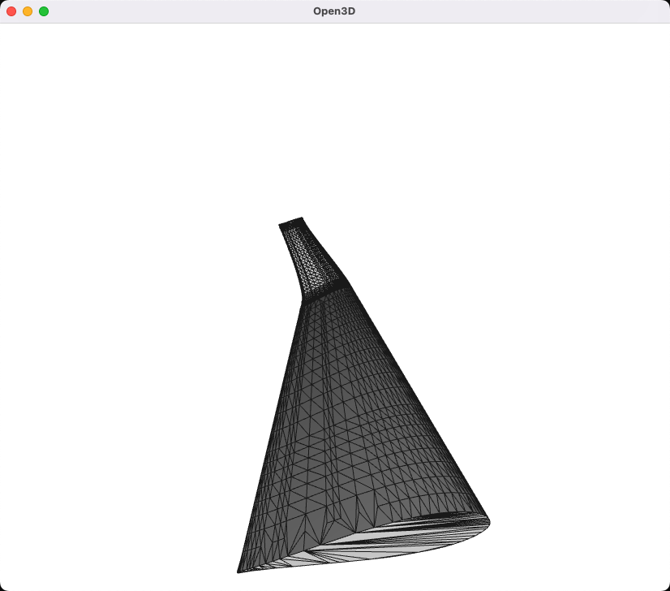
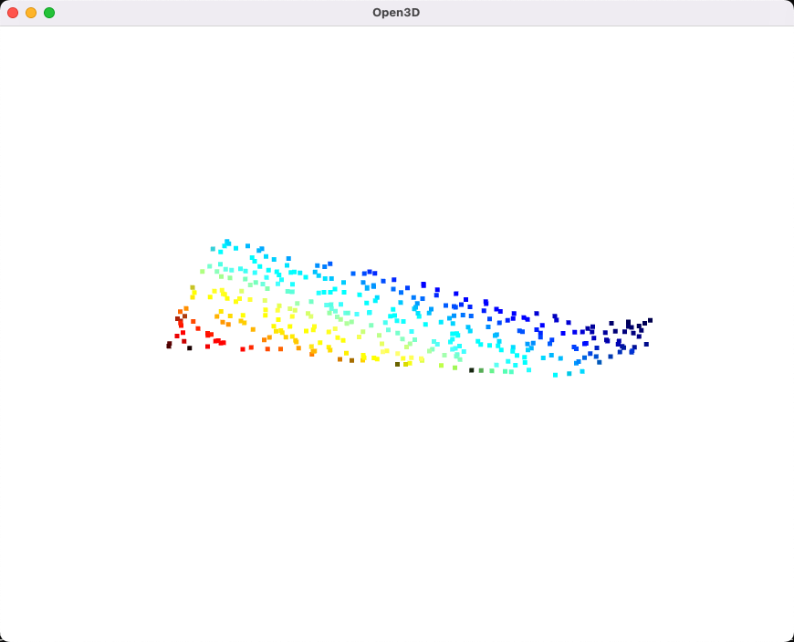
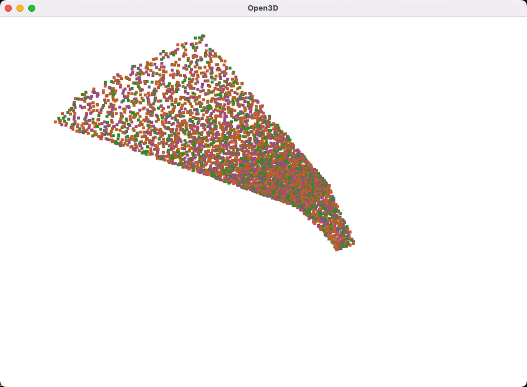

# Inflation

该函数库主要实现了读入STL 几何图形，并通过外法向量进行外扩的功能。

## inflation

```python
def inflation(mesh, dis):
    """
    Inflation the mesh

    Parameters
    ----------
    mesh : open3d.geometry.TriangleMesh
        The mesh to be inflated
    dis : float
        The distance to inflate

    Returns
    -------
    open3d.geometry.TriangleMesh
        The inflated mesh
    """
```

该函数输入一个三角网格，以及一个外扩距离，输出一个外扩后的三角网格。

## Example

```python
import open3d as o3d
from inflation import inflation

mesh = o3d.io.read_triangle_mesh("./example/wing.stl")
mesh.compute_vertex_normals()
mesh.paint_uniform_color([0.5, 0.5, 0.5])
o3d.visualization.draw_geometries([mesh], mesh_show_wireframe=True)

mesh_inflated = inflation(mesh, 0.01)
mesh_inflated.compute_vertex_normals()
o3d.visualization.draw_geometries([mesh_inflated], mesh_show_wireframe=True)
```



---

## sample_points

```python
def sample_points(mesh, number_of_points=100, mode="uniform", seed=-1):
    """
    Sample points from the mesh

    Parameters
    ----------

    mesh : open3d.geometry.TriangleMesh
        The mesh to be sampled

    density : int
        The density of points to be sampled

    mode : str
        The mode of sampling, can be "uniform" or "poisson_disk"

    seed : int
        The seed of random number generator

    Returns
    -------
    open3d.geometry.PointCloud
    """
```

该函数输入一个三角网格，以及一个采样点数目，输出一个采样点云。

对open3D中的采样函数进行了封装，定义了 density 量，其含义为单位面积采样点数目。

## Example

```python
import open3d as o3d
from inflation import sample_points

mesh = o3d.io.read_triangle_mesh("./example/wing.stl")

points = sample_points(mesh, 10, "uniform")
o3d.visualization.draw_geometries([points])

points = sample_points(mesh, 10, "poisson_disk")
o3d.visualization.draw_geometries([points])
```



---

## inflation_sample

```python
def inflation_sample(
    mesh,
    dis=(float, list, np.ndarray),
    density=(float, list, np.ndarray),
    mode="uniform",
    seed=-1,
):
    """
    Inflation the mesh and sample points from the inflated mesh

    Parameters
    ----------
    mesh : open3d.geometry.TriangleMesh

    dis : float or list or np.ndarray
        The distance to inflate

    density : float or list or np.ndarray
        The density of points to be sampled

    mode : str
        The mode of sampling, can be "uniform" or "poisson_disk"

    seed : int
        The seed of random number generator

    Returns
    -------
    open3d.geometry.PointCloud
    """
```

该函数输入一个三角网格，以及外扩距离序列（间隔距离），采样密度序列，输出一个采样点云。

## Example

```python
import open3d as o3d
import inflation as inf
import numpy as np

mesh = o3d.io.read_triangle_mesh("./example/wing")


pcs = inf.inflation_sample(
    mesh,
    dis=np.ones(5) * 0.1,
    density=np.linspace(1, 0.5, 5),
    mode="uniform",
    seed=0,
)

o3d.visualization.draw_geometries(pcs)
```



# 注意⚠️

inflation 不应该外扩过多距离，否则对于网格中的部分凹面，会导致外扩后的凹面变成凸面（翻转），从而导致采样点云中出现异常点。
